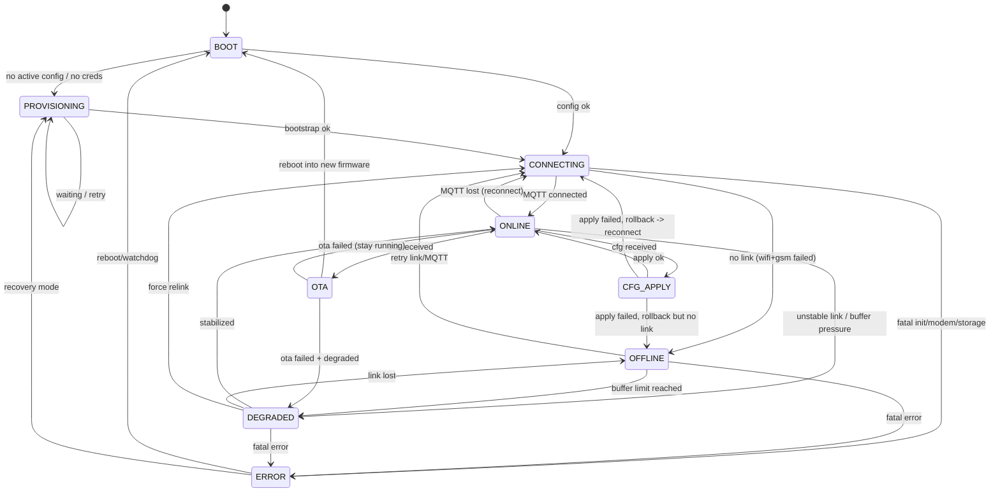

```md
# Vexora Device State Machine v1 (Firmware)

Цель: описать состояния устройства и переходы так, чтобы firmware, backend и app одинаково понимали,
что происходит с устройством (Wi-Fi/GSM, provisioning, конфиг, оффлайн-режим).

---

## 0) Термины

- **Link** — активный канал связи устройства: `wifi` или `gsm`
- **Online** — есть MQTT-сессия и успешно публикуется `state`
- **Degraded** — устройство работает, но есть ограничения (например, буфер, слабый сигнал, частые реконнекты)
- **Provisioning** — получение/применение первичных секретов/настроек

---

## 1) Состояния

### S0: BOOT
**Вход:** старт MCU / reboot  
**Действия:**
- init hardware (датчики, питание, модемы)
- load `active` config (если есть)
- init storage (NVS/flash)
- compute `deviceId`
- publish `event` при ошибках инициализации (если MQTT доступен позже — отправить при восстановлении)

**Переходы:**
- если нет `active` config или нет credentials → **S1 PROVISIONING**
- иначе → **S2 CONNECTING**

---

### S1: PROVISIONING
**Назначение:** “первый запуск” или восстановление.

**Вариант A (рекомендуемый для MVP):** provisioning через MQTT невозможен без связи, поэтому делаем локальный режим:
- устройство поднимает локальный AP / BLE (по кнопке или если нет конфига)
- приложение передаёт минимум: Wi-Fi creds, GSM APN creds, broker host, device token (или activation code)

**Действия:**
- принять `bootstrap config`
- валидировать
- сохранить как `active` (version=1)
- перейти в CONNECTING

**Переходы:**
- успех → **S2 CONNECTING**
- ошибка/таймаут → остаёмся в **S1** (с ограниченным циклом попыток + backoff)

---

### S2: CONNECTING
**Назначение:** поднять связь и MQTT.

**Действия:**
- попытка подключения по Wi-Fi (до `wifiTimeoutSec`)
- если Wi-Fi не удалось → попытка GSM (APN attach, PDP context)
- установить MQTT соединение
- после коннекта:
  - subscribe: `cmd/cfg/ota`
  - publish retained `state` (online)
  - publish `cfg/status` (retained)

**Переходы:**
- MQTT connected → **S3 ONLINE**
- не удалось ни Wi-Fi, ни GSM → **S4 OFFLINE**
- критическая ошибка модема/хранилища → **S6 ERROR**

---

### S3: ONLINE
**Назначение:** нормальная работа.

**Действия:**
- периодически публиковать `telemetry` (по `telemetry.intervalSec`)
- обновлять `state` (retained) при изменениях:
  - link, rssi, ip
  - battery/vin
  - cfg versions
  - ошибка датчиков/модуля
- принимать `cmd/cfg/ota` и отвечать `ack`

**Переходы:**
- MQTT disconnect → **S5 DEGRADED** (если есть локальная работа) или **S2 CONNECTING**
- получен `cfg` → **S7 CFG_APPLY**
- получен `ota` → **S8 OTA**
- множественные провалы отправки / buffer overflow → **S5 DEGRADED**

---

### S4: OFFLINE
**Назначение:** связи нет, но устройство продолжает работу локально.

**Действия:**
- продолжать сбор данных в локальный буфер (если включено)
- периодически пытаться восстановить связь:
  - Wi-Fi попытка каждые `wifiRetrySec`
  - GSM попытка каждые `gsmRetrySec`
- при критичных событиях писать `event` в локальный журнал (для отправки при восстановлении)

**Переходы:**
- восстановили MQTT → **S3 ONLINE**
- достигнут лимит буфера → **S5 DEGRADED** (и публиковать event при первом же коннекте)
- критическая ошибка → **S6 ERROR**

---

### S5: DEGRADED
**Назначение:** устройство работает, но с ограничениями (частые реконнекты, слабый сигнал, переполненный буфер).

**Действия:**
- снизить частоту телеметрии (например, *min interval*) или перейти на агрегирование
- попытаться стабилизировать связь:
  - сменить link (wifi↔gsm) по стратегии
- публиковать `event` при входе в деградацию и при выходе

**Переходы:**
- связь стабилизирована → **S3 ONLINE**
- связь потеряна полностью → **S4 OFFLINE**
- критическая ошибка → **S6 ERROR**

---

### S6: ERROR
**Назначение:** фатальная ошибка (не удалось загрузить конфиг, сломано хранилище, модем не отвечает).

**Действия:**
- publish `event` (если возможно)
- безопасный режим (минимальные функции)
- если возможно — инициировать reboot по watchdog / после таймера

**Переходы:**
- reboot → **S0 BOOT**
- если есть recovery path → **S1 PROVISIONING**

---

### S7: CFG_APPLY
**Назначение:** применить конфигурацию безопасно (двухфазно + rollback).

**Действия (строго по шагам):**
1) сохранить `cfg` как `pending`
2) валидировать
3) применить (без уничтожения предыдущего `active`)
4) попытаться восстановить связь (MQTT) с новым конфигом
5) если ок → `active = pending`, `previous = old active`, очистить pending
6) если не ок → rollback на previous active

**Публикации:**
- `cfg/status` (retained) после успеха/ошибки
- `ack` на `cfg` с `ok=true/false`

**Переходы:**
- успех → **S3 ONLINE**
- провал + rollback → **S2 CONNECTING** или **S4 OFFLINE** (в зависимости от связи)

---

### S8: OTA
**Назначение:** обновление прошивки.

**Действия:**
- скачать firmware
- проверить `sha256`
- записать во вторую партицию
- поставить флаг boot в новую
- reboot

**Публикации:**
- `event` о начале/успехе/провале
- `ack` на `ota`

**Переходы:**
- reboot → **S0 BOOT**
- провал → **S3 ONLINE** или **S5 DEGRADED**

---

## 2) Стратегия выбора линка (Wi-Fi/GSM) v1

Правило:
1) Wi-Fi имеет приоритет
2) если Wi-Fi не поднялся за `wifiTimeoutSec` → GSM
3) при работе на GSM каждые `wifiProbeSec` пробовать вернуть Wi-Fi
4) если GSM нестабилен — допускается возврат в OFFLINE + backoff

Рекомендуемые параметры (MVP):
- wifiTimeoutSec: 15–30
- gsmTimeoutSec: 45–90
- wifiProbeSec (когда на GSM): 300
- wifiRetrySec (offline): 60
- gsmRetrySec (offline): 180

---

## 3) Что обязано отражаться в MQTT state

При каждом важном изменении публикуем `v1/dev/{deviceId}/state` (retained):
- `status`: online/offline/degraded/error
- `link`: type, rssi, ip (если wifi)
- `fw`: версия прошивки
- `uptimeSec`
- `cfg.activeVersion`, `cfg.pendingVersion`

---

## 4) События (event) при смене состояния (рекомендуемо)

Коды:
- `STATE_ONLINE`
- `STATE_OFFLINE`
- `STATE_DEGRADED`
- `STATE_ERROR`
- `LINK_SWITCH_WIFI_TO_GSM`
- `LINK_SWITCH_GSM_TO_WIFI`
- `CFG_APPLY_OK`
- `CFG_APPLY_FAIL`
- `OTA_START`
- `OTA_OK`
- `OTA_FAIL`

## 5) Диаграмма
```
